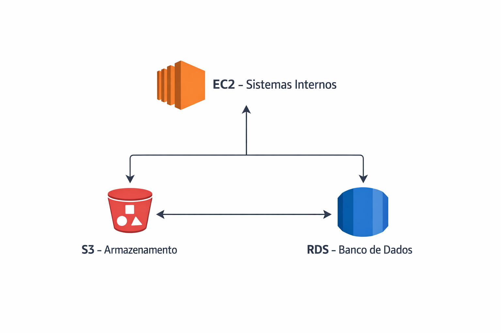

# RELATÓRIO DE IMPLEMENTAÇÃO DE SERVIÇOS AWS

Data: 17/01/2026  
Empresa: Abstergo Industries  
Responsável: Vitória Alvares dos Santos 

## Introdução

Este relatório apresenta uma proposta inicial de implementação de serviços em nuvem na empresa **Abstergo Industries**, uma empresa do setor farmacêutico que atua como hub de distribuição para outras empresas e farmácias. A proposta foi elaborada por Vitória Alvares dos Santos.

O objetivo principal deste projeto é **reduzir custos operacionais**, aumentar a **eficiência dos processos** e trazer **previsibilidade financeira** a partir de uma perspectiva técnica e operacional, utilizando três serviços da Amazon Web Services (AWS).  
As soluções propostas consideram o cenário atual da empresa, que até o momento não possui qualquer estrutura em nuvem implementada.

---

## Descrição do Projeto

O projeto de foi dividido em três etapas, cada uma focada em um serviço AWS estratégico para redução de custos e melhoria operacional.  
A seguir, serão descritas as etapas do projeto:

---

### Etapa 1: Amazon EC2

- **Foco da ferramenta:** Hospedagem de servidores e sistemas internos
- **Descrição de caso de uso:**

O Amazon EC2 permite a criação de máquinas virtuais sob demanda, eliminando a necessidade de compra e manutenção de servidores físicos. Para a Abstergo, o EC2 pode ser utilizado para hospedar sistemas de gestão, controle de estoque e integração com parceiros.

**Redução de custos:**  
- Pagamento apenas pelo tempo de uso dos servidores  
- Eliminação de custos com hardware, energia elétrica e manutenção  
- Possibilidade de desligar instâncias fora do horário comercial  

**Principal ganho:**  
Flexibilidade e escalabilidade, permitindo ajustar os recursos conforme a demanda do negócio.

---

### Etapa 2: Amazon S3

- **Foco da ferramenta:** Armazenamento de dados e documentos
- **Descrição de caso de uso:** 

O Amazon S3 é um serviço de armazenamento altamente durável e de baixo custo. Ele pode ser utilizado para armazenar documentos fiscais, notas, relatórios, contratos, imagens de produtos e backups do sistema.

**Redução de custos:**  
- Substitui servidores de arquivos locais  
- Custo menor comparado a soluções tradicionais de armazenamento  
- Pagamento proporcional ao volume armazenado  

**Principal ganho:**  
Segurança, alta disponibilidade dos dados e facilidade de acesso de qualquer local.

---

### Etapa 3: Amazon RDS

- **Foco da ferramenta:** Banco de dados gerenciado
- **Descrição do caso de uso:**

O Amazon RDS permite o uso de bancos de dados relacionais sem a necessidade de gerenciamento manual. Ele pode ser utilizado para armazenar dados de pedidos, clientes, fornecedores e movimentações de estoque.

**Redução de custos:**  
- Elimina custos com administração manual de banco de dados  
- Backup automático incluso  
- Redução de falhas e tempo de indisponibilidade  

**Principal ganho:**  
Confiabilidade e menor custo operacional com equipes técnicas.

---

## Conclusão

A implementação dos serviços **Amazon EC2, Amazon S3 e Amazon RDS** na empresa **Abstergo Industries** tem como resultado esperado a **redução imediata de custos**, **maior controle financeiro** e **aumento da eficiência operacional**.

Essas soluções permitem que a empresa pague apenas pelo que utiliza, evitando investimentos iniciais elevados em infraestrutura física. Recomenda-se a continuidade da adoção de serviços em nuvem e a avaliação de novas soluções AWS conforme o crescimento do negócio.

---

### Arquitetura AWS da Abstergo

  

*Figura 1: Diagrama mostrando a interação entre EC2, S3 e RDS na Abstergo Industries.* 
- **EC2** → Servidores internos e processamento  
- **S3** → Armazenamento de arquivos  
- **RDS** → Banco de dados relacional gerenciado

---

## Anexos

- Documentação oficial da **AWS**:
  - **EC2**: https://docs.aws.amazon.com/ec2/index.html
  - **S3**: https://docs.aws.amazon.com/s3/index.html
  - **RDS**: https://docs.aws.amazon.com/rds/index.html
- Diagrama da Arquitetura AWS

---

### Assinatura do Responsável pelo Projeto:
### Vitória Alvares dos Santos
### Contatos:  
  
  